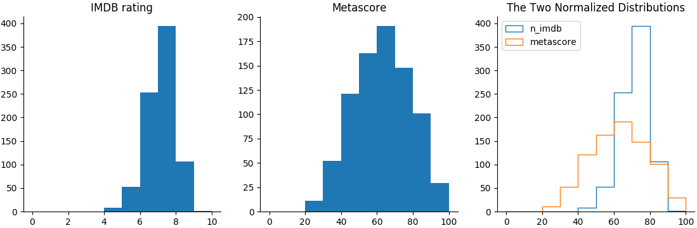

## Intro
Obtain a list of movies along with imdb rating & Metascore .Movies are sorted by No of Votes in Descending order per year.The movies scraped will be saved as dataset.csv

## Demo
1. From : 2000
2. To : 2017
3. No of pages to be scraped per year = 1

## Graph

## Analysis
1. Starting with the IMDB histogram, we can see that most ratings are between 6 and 8. There are few movies with a rating greater than 8, and even fewer with a rating smaller than 4. This indicates that both very good movies and very bad movies are rarer.

2. The distribution of Metascore ratings resembles a normal distribution - most ratings are average, peaking at the value of approximately 60. From this peak, the frequencies gradually decrease toward extreme rating values. According to this distribution, there are indeed fewer very good and very bad movies, but not that few as the IMDB ratings indicate.

3. On the comparative graph, it’s clearer that the IMDB distribution is highly skewed toward the higher part of the average ratings, while the Metascore ratings seem to have a much more balanced distribution.

4. What might be the reason for that skew in the IMDB distribution? One hypothesis is that many users tend to have a binary method of assessing movies. If they like the movie, they give it a 10. If they don’t like the movie, they give it a very small rating, or they don’t bother to rate the movie.